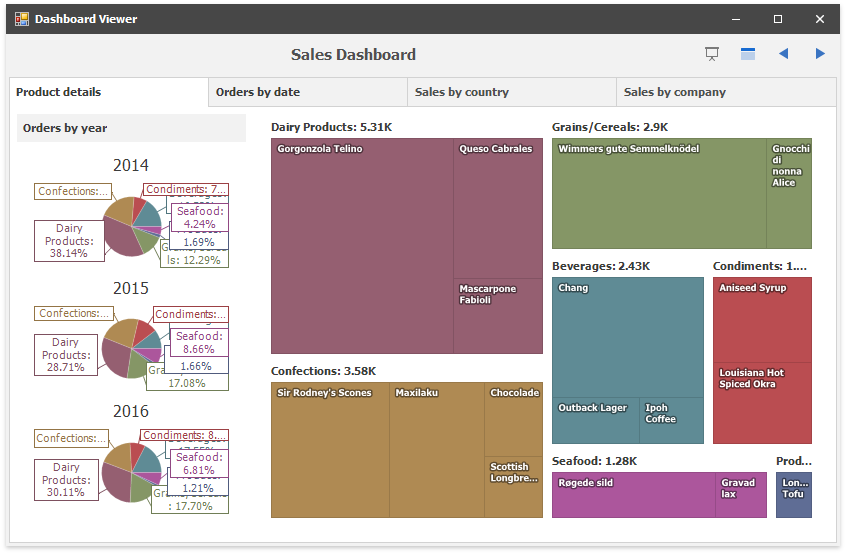

<!-- default badges list -->

<!-- default badges end -->
# Dashboard for WinForms - How to navigate tabs using custom tab header buttons or set up a slide show

This example illustrates methods and events used to manage the selected tabs.

The application uses the `DashboardViewer` control to load a sample dashboard and show custom buttons in the [dashboard title](https://docs.devexpress.com/Dashboard/15618/creating-dashboards/creating-dashboards-in-the-winforms-designer/dashboard-layout/dashboard-title).

Custom buttons are created within the [DashboardViewer.CustomizeDashboardTitle](https://docs.devexpress.com/Dashboard/DevExpress.DashboardWin.DashboardViewer.CustomizeDashboardTitle) event handler. Buttons are the [DashboardToolbarItem](https://docs.devexpress.com/Dashboard/DevExpress.DashboardWin.DashboardToolbarItem) objects inserted into [e.Items](https://docs.devexpress.com/Dashboard/DevExpress.DashboardWin.CustomizeDashboardCaptionBaseEventArgs.Items) collection. The button click event handler is specified in the DashboardToolbarItem constructor. The DashboardToolbarItem's [Tag](https://docs.devexpress.com/Dashboard/DevExpress.DashboardWin.DashboardToolbarItem.Tag) property holds the navigation direction value.

When an end user clicks a navigation button, the [DashboardViewer.GetSelectedTabPageIndex](https://docs.devexpress.com/Dashboard/DevExpress.DashboardWin.DashboardViewer.GetSelectedTabPageIndex(System.String)) method is used to find the selected page index. Subsequently the index is incremented or decremented depending on the navigation direction and the [DashboardViewer.SetSelectedTabPage](https://docs.devexpress.com/Dashboard/DevExpress.DashboardWin.DashboardViewer.SetSelectedTabPage(System.String-System.Int32)) method selects the next or previous page.

The **Slideshow** button starts the timer. Each timer tick forces the [transition manager](https://docs.devexpress.com/WindowsForms/DevExpress.Utils.Animation.TransitionManager) to start the animated transition, calls the [DashboardViewer.SetSelectedTabPage](https://docs.devexpress.com/Dashboard/DevExpress.DashboardWin.DashboardViewer.SetSelectedTabPage(System.String-System.Int32)) method to select the next page and finishes the transition.

The **Show Tab Headers** button toggles the [TabContainerDashboardItem.ShowCaption](https://docs.devexpress.com/Dashboard/DevExpress.DashboardCommon.DashboardItem.ShowCaption) value to hide or show tab captions. 

## Files to Review

* [ViewerForm.cs](./CS/DashboardNextPrevTab/ViewerForm.cs)

## Documentation

- [Title and Item Captions](https://docs.devexpress.com/Dashboard/401132/winforms-dashboard/winforms-viewer/title-and-item-captions)
- [Dashboard Layout](https://docs.devexpress.com/Dashboard/15617)

## More Examples 

* [How to: Add a Command Button to the Dashboard Title and Item Caption](https://github.com/DevExpress-Examples/winforms-dashboard-custom-command-buttons)
* [How to Customize the Dashboard Title and Dashboard Item Captions](https://github.com/DevExpress-Examples/winforms-dashboard-how-to-customize-the-dashboard-title-and-dashboard-item-captions-t630210)
* [Dashboard for Web Forms - How to navigate between tabs using custom tab header buttons or set up a slide show](https://github.com/DevExpress-Examples/Web-Dashboard-Slideshow-TabContainer-Navigation)
<!-- feedback -->
## Does this example address your development requirements/objectives?

 

(you will be redirected to DevExpress.com to submit your response)
<!-- feedback end -->
